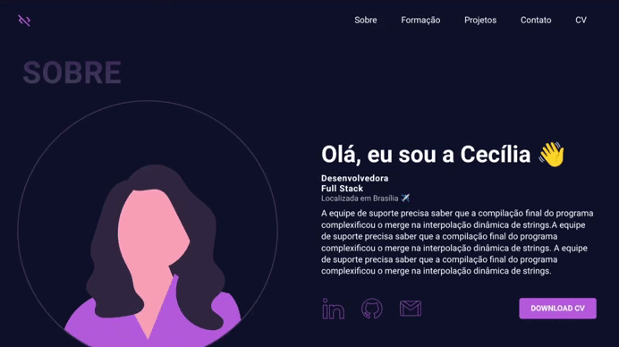

# Projeto - Google UX Design Certificate
 
Este projeto foi desenvolvido como parte do desafio do curso **Google UX Design Certificate**, um programa de certificação voltado para iniciantes em design. O curso é dividido em módulos semanais, com avaliações ao final de cada etapa.

## Tecnologias Utilizadas

- HTML
- CSS
- Figma

## Captura de Tela do Projeto



## Acesse o Protótipo no Figma

[Acesse o protótipo do projeto no Figma](https://www.figma.com/design/uhjrTuFFCvJSOoPSBoTsl3/projeto-google-ux?node-id=0-1&t=T5oJpt1BmVYHRtNB-1)

## Como Executar o Projeto

1. Clone este repositório:
   ```bash
   git clone git@github.com:cecilia-martins/desafio-google-ux-portfolio.git
   ```
2. Acesse o diretório do projeto:
   ```bash
   cd desafio-google-ux-portfolio
   ```
3. Abra o arquivo `index.html` no navegador.

## Contato

[LinkedIn](www.linkedin.com/in/cecilia-martinss) | [GitHub](https://github.com/cecilia-martins) | [E-mail](mailto\:cecilia_lmartins@hotmail.com)

